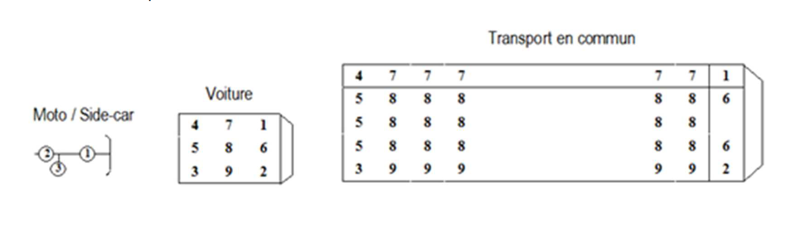

```{r setup, include=FALSE, echo=FALSE}
knitr::opts_chunk$set(echo = TRUE)
```
## Présentation du jeu de données 

Fichiers rempli par les forces de l’ordre intervenue sur l’accident.

 - CARACTERISTIQUES : décrit les circonstances générales de l’accident
 - LIEUX :  décrit  le  lieu  principal  de  l’accident
 - VEHICULES : Véhicule impliqué dans l’accident
 - USAGERS : Usager impliqué dans un accident

## CARACTERISTIQUES

 - Num_Acc : Numéro d'identifiant de l’accident.  
 - hrmn : Heure et minutes de l'accident.
 - jour
 - mois  
 - an
 - lum : Lumière : conditions d’éclairage dans lesquelles l'accident s'est produit
 - dep
 - com
 - agg : Hors agglomération ou non
 - int : type d’intersection
 - atm : Conditions atmosphériques
 - col : Type de collision
 - adr : Adresse postale
 - lat
 - long

## LIEUX

 - Num_Acc : Numéro d'identifiant de l’accident.  
 - catr : Catégorie de route
 - voie : Numéro de la route
 - V1 : Indice numérique du numéro de route (exemple : 2 bis, 3 ter etc.).
 - V2 : Lettre indice alphanumérique de la route. 
 - circ : Régime de circulation
 - nbv : Nombre total de voies de circulation.
 - vosp : Signale l’existence d’une voie réservée, indépendamment du fait que l’accident ait lieu ou non sur  cette voie.
 - prof : Profil en long décrit la déclivité de la route à l'endroit de l'accident :  
 - pr : Numéro du PR de rattachement (numéro de la borne amont).
 - pr1 : Distance en mètres au PR (par rapport à la borne amont).   
 - plan : Tracé en plan :  
 - lartpc : Largeur du terre-plein central (TPC) s'il existe (en m).  
 - larrout : Largeur de la chaussée affectée à la circulation des véhicules ne sont pas compris les bandes d'arrêt  d'urgence, les TPC et les places de stationnement (en m).  
 - surf : Etat de la surface :
 - infra : Aménagement (Souterrain,  Voie ferrée...)
 - situ : Situation de l’accident (trottoir, piste cyclable...)
 - vma : Vitesse maximale autorisée sur le lieu et au moment de l’accident.

## VÉHICULES

 - Num_Acc    
 - id_vehicule  : Identifiant unique du véhicule repris pour chacun des usagers occupant ce véhicule (y compris les  piétons qui sont rattachés aux véhicules qui les ont heurtés) 
 - Num_Veh : Identifiant du véhicule repris pour chacun des usagers occupant ce véhicule (y compris les piétons qui sont rattachés aux véhicules qui les ont heurtés)
 - senc : Sens de circulation
 - catv : Catégorie du véhicule  
 - obs : Obstacle fixe heurté  
 - obsm : Obstacle mobile heurté  
 - choc : Point de choc initial  
 - manv : Manoeuvre principale avant l’accident
 - motor : Type de motorisation du véhicule
 - occutc : Nombre d’occupants dans le transport en commun

## USAGERS

 - Num_Acc
 - id_vehicule : Identifiant unique du véhicule repris pour chacun des usagers occupant ce véhicule
 - Num_Veh : Identifiant du véhicule repris pour chacun des usagers occupant ce véhicule
 - place : Permet de situer la place occupée dans le véhicule par l'usager au moment de l'accident.
 - catu : Catégorie d'usager  
 - grav : Gravité de blessure de l'usager
 - sexe : Sexe de l'usager
 - An_nais : Année de naissance de l'usager.  
 - trajet : Motif du déplacement au moment de l’accident
 - secu1 : Le renseignement du caractère indique la présence et l’utilisation de l’équipement de sécurité :  
 - secu2 : Le renseignement du caractère indique la présence et l’utilisation de l’équipement de sécurité :  
 - secu3 : Le renseignement du caractère indique la présence et l’utilisation de l’équipement de sécurité :  
 - locp : Localisation du piéton
 - actp : Action du piéton
 - etatp : Cette variable permet de préciser si le piéton accidenté était seul ou non


```{r}
library("ggplot2")
library("dplyr")
library("lubridate")
library("plotly")
library("leaflet")
library("viridisLite")
library("broom")

accidents <- read.csv("clean_datasets/accidents.csv", sep=',', header = TRUE)
usagers <- read.csv("clean_datasets/usagers.csv", sep=',')
anhr <- setNames(data.frame(table(accidents$an, accidents$hr)), c("an", "hr", "count"))
```

## Dates

```{r, warning=FALSE, out.height = '700px', out.width = '100%'}

d1 <- setNames(data.frame(table(as.Date(paste(accidents$an, accidents$mois, accidents$jour, sep='-')))),c("Date","Count"))
d1$day <- weekdays(as.Date(d1$Date))

d2 <- d1 %>%
  mutate(Mois=month(Date), Date = as.Date(paste(year(Date), month(Date), '01', sep = '-'))) %>%
  group_by(Date, Mois) %>%
  summarise(Count = sum(Count))

d3 <- d1 %>%
  mutate(Date = month(Date)) %>%
  group_by(Date) %>%
  summarise(Count = sum(Count))

d4 <- d1 %>%
  mutate(Mois=month(Date), Day=day(Date), p=paste(month(Date), day(Date)), Date = as.Date(paste(year(Date), month(Date), day(Date), sep = '-'))) %>%
  group_by(Day, Mois, p, Date) %>%
  summarise(Count = sum(Count))
d4 <- d4[ with(d4, order(Mois, Day)), ]

d5 <- setNames(data.frame(table(weekdays(as.Date(paste(accidents$an, accidents$mois, accidents$jour, sep='-'))), accidents$hr )),c("Day", "hr", "Count"))

plot_ly(d1, x=~day) %>%
	add_boxplot(y=~Count) %>%
	layout(title = "Nombre d'accident en fonction des jours de la semaines de 2005 à 2019",
		   yaxis = list(title="Nombre d'accidents"),
		   xaxis = list(title = "Jours de la semaine", categoryorder = "array", categoryarray = c("lundi", "mardi", "mercredi", "jeudi", "vendredi", "samedi", "dimanche")))
```

```{r, warning=FALSE, out.height = '700px', out.width = '100%'}
plot_ly(d1, x=~factor(day, levels=c("lundi", "mardi", "mercredi", "jeudi", "vendredi", "samedi", "dimanche"))) %>%
	add_boxplot(y=~Count, color=~factor(month.abb[month(Date)], levels = month.abb)) %>%
	layout(title = "Nombre d'accident en fonction des jours de la semaines de 2005 ? 2019", xaxis=list(title="Jours de la semaine"), yaxis=list(title="Nombre d'accidents"), boxmode = "group")
```

```{r, warning=FALSE, out.height = '700px', out.width = '100%'}
plot_ly(d2, x=~factor(month.abb[Mois], levels = month.abb)) %>%
	add_boxplot(y=~Count) %>%
	layout(title = "Nombre d'accident en fonction des mois de l'annee de 2005 ? 2019", xaxis = list(title="Mois de l'annee"), yaxis = list(title="Nombre d'accidents")) #par mois
```

```{r, warning=FALSE, out.height = '700px', out.width = '100%'}
plot_ly(d1, x=~factor(month.abb[month(Date)], levels = month.abb)) %>%
	add_boxplot(y=~Count, color=~factor(day , levels=c("lundi", "mardi", "mercredi", "jeudi", "vendredi", "samedi", "dimanche"))) %>%
	layout(title = "Nombre d'accident en fonction des mois de l'annee de 2005 à 2019",xaxis=list(title="Mois de l'annee"), yaxis=list(title="Nombre d'accidents"),boxmode = "group")
```

```{r, warning=FALSE, out.height = '700px', out.width = '100%'}
plot_ly(d1, x=~day(Date)) %>%
	add_boxplot(y=~Count) %>%
	layout(title = "Nombre d'accident en fonction du jour du mois de l'annee de 2005 à 2019", xaxis=list(title="Jours du mois", yaxis=list(title="Nombre d'accidents")))
```

```{r, warning=FALSE, out.height = '700px', out.width = '100%'}

plot_ly(d1, x=~week(Date)) %>%
	add_boxplot(y=~Count) %>%
	layout(title = "Nombre d'accident en fonction du numero de la semaine de 2005 à 2019", xaxis = list(title="Numero de la semaine"), yaxis = list(title="Nombre d'accidents")) #par semaine


```

```{r, warning=FALSE, out.height = '700px', out.width = '100%'}
plot_ly(d4, x=~p) %>%
	add_boxplot(y=~Count) %>%
	layout(xaxis = list(categoryorder = "array", categoryarray =d4$p)) %>%
	layout(title = "Nombre d'accident en fonction des jours de l'annee de 2005 à 2019", xaxis = list(title="Jour de l'ann?e"), yaxis = list(title="Nombre d'accidents")) #par jour
```

```{r, warning=FALSE, out.height = '700px', out.width = '100%'}
plot_ly(anhr, x=~hr, y=~count, color=~an, type='scatter', mode = 'lines') %>%
	layout(title = "Nombre d'accident en fonction de l'heure de l'annee de 2005 a 2019", xaxis = list(title="Heure"), yaxis = list(title="Nombre d'accident"))


```

```{r, warning=FALSE, out.height = '700px', out.width = '100%'}
plot_ly(anhr, x=~an, y=~count, color=~hr, type='scatter', mode = 'lines') %>%
	layout(title = "Nombre d'accident en fonction de l'heure de l'annee de 2005 a 2019",xaxis = list(title="Annee"), yaxis = list(title="Nombre d'accident"))

```

```{r, warning=FALSE, out.height = '700px', out.width = '100%'}
plot_ly(anhr, x=~hr, y=~an, z=~count, type="heatmap") %>%
	layout(title = "Nombre d'accident en fonction de l'heure et de l'annee de 2005 a 2019",xaxis = list(title="Heure"), yaxis = list(title="Annee"))

```

```{r, warning=FALSE, out.height = '700px', out.width = '100%'}
plot_ly(anhr, x=~hr, y=~an, z=~count, color=~an, type="scatter3d",  mode = 'lines', line = list(width = 30)) # osef de lui ?

```

```{r, warning=FALSE, out.height = '700px', out.width = '100%'}
plot_ly(anhr, x=~hr, y=~count, color=~an, type="bar")

```

```{r, warning=FALSE, out.height = '700px', out.width = '100%'}
d5 <- setNames(data.frame(table(weekdays(as.Date(paste(accidents$an, accidents$mois, accidents$jour, sep='-'))), accidents$hr )),c("Day", "hr", "Count"))

plot_ly(d5, x=~Day, y=~Count, color=~hr, type="bar") %>%
	layout(yaxis = list(title="Nombre d'accidents"),
		   xaxis = list(title = "Jours de la semaine",
		   			 	categoryorder = "array",
		   			 	categoryarray = c("lundi", "mardi", "mercredi", "jeudi", "vendredi", "samedi", "dimanche")))

```

```{r, warning=FALSE, out.height = '700px', out.width = '100%'}
plot_ly(d5, x=~hr, y=~Count, color=~factor(Day , levels=c("lundi", "mardi", "mercredi", "jeudi", "vendredi", "samedi", "dimanche")), type="bar")

```


```{r, warning=FALSE, out.height = '600px', out.width = '100%'}
ggplot(accidents, aes(x=an)) + geom_bar() + ggtitle("Nombre d'accident par an") + xlab("Annee") + ylab("Nombre d'accident") + geom_text(aes(label = ..count..), stat = "count", vjust = 1.5, colour = "white")

ggplot(accidents, aes(x=mois)) + geom_bar()+ggtitle("Nombre d'accident par mois")+ xlab("Mois")+ylab("Nombre d'accident")+ geom_text(aes(label = ..count..), stat = "count", vjust = 1.5, colour = "white")
```



```{r, warning=FALSE, out.height = '700px', out.width = '100%'}
d8 <- setNames(data.frame(table(usagers[usagers$place != 1,]$place)), c('place', 'count'))
plot_ly(d8, x=~place) %>%
	add_bars(d8, y=~count, text=~paste0(formatC(100 * count/sum(count), format='f', digits = 2), "%\n\n", place), textposition = 'auto') %>%
	layout(xaxis=list(showticklabels = FALSE))
```

```{r, warning=FALSE, out.height = '700px', out.width = '100%'}
labeller.sexe <- function(variable, value){ return (list("1"="Homme", "2"="Femme")[value])}
d7 <- setNames(data.frame(table(usagers$an - usagers$an_nais, usagers$sexe, usagers$grav)), c("age", "sexe", "grav", "total"))

ggplotly(ggplot(d7) + aes(x=age, y=total, fill=factor(grav, levels=c(1,4,3,2))) + geom_bar(stat="identity") + scale_x_discrete(name="âge", breaks = seq(0, 100, 5)))

ggplotly(ggplot(d7) + aes(x=age, y=total, fill=factor(grav, levels=c(1,4,3,2))) + geom_bar(stat="identity") + facet_wrap(~sexe, labeller=labeller.sexe) + scale_x_discrete(name="âge", breaks = seq(0, 100, 5)))
```


```{r, warning=FALSE, out.height = '700px', out.width = '100%'}
d6 <- d1[,c("Date", "Count")]
d6$breaks <- as.Date(cut(as.Date(d1$Date, format = "%Y-%m-%d"), breaks = "33 days"), format = "%Y-%m-%d")
d6 <- d6 %>% group_by(breaks) %>% summarise(Count = sum(Count))
lois = data.frame(Date = c("2012-01-05", "2012-07-01", "2018-07-01"), text=c("avertisseurs de radars interdits", "éthylotest obligatoirs", "loi 80Km/h"))

l <- loess(Count ~ as.numeric(breaks), data=d6)
r <- setNames(augment(l), c("Count", ".se.fit", ".fitted"))
r$breaks <- d6$breaks

plot_ly(d6, x=~breaks) %>%
	add_lines(y=~Count, name='Total', opacity=0.25, line = list(color = '#553333')) %>%
	add_lines(y=~fitted(l), line=list(color='#07A4B5'), name="Loess Smoother", showlegend=TRUE) %>%
	add_ribbons(data=r, ymin = ~.fitted - 0.04 * .se.fit, ymax = ~.fitted + 0.04 * .se.fit, line = list(color = 'rgba(7, 164, 181, 0.05)'), fillcolor = 'rgba(7, 164, 181, 0.2)', name = "Standard Error") %>%
	add_segments(data=lois, x=~Date, xend=~Date, color=~text, colors=~colors, text=~text, y=min(d6$Count), yend=max(d6$Count))
```

## Cartes

```{r, warning=FALSE, out.height = '600px', out.width = '100%'}

ggplot(accidents, aes(x=dep)) + geom_bar()+ggtitle("Nombre d'accidents par departement")+ xlab("Numero de departement")+ylab("Nombre d'accident")+ geom_text(aes(label = dep), vjust=.35, hjust = -.5,angle=90, stat = "count", colour = "black") + theme(axis.text.x=element_blank(), axis.ticks.x=element_blank())
```

## Cartes Paris

```{r, warning=FALSE, out.height = '700px', out.width = '100%'}
map.opacity = 0.30
paris <- accidents[(accidents$dep == 75) & (accidents$an == 2019), ] # paris en 2019
leaflet(data = paris) %>% addCircleMarkers(~long, ~lat, color="red", radius= 2, stroke = FALSE, fillOpacity = 0.5) %>% addProviderTiles("Stamen.Toner", options = list(opacity=map.opacity))
```

## Cartes - Marne

```{r, warning=FALSE, out.height = '700px', out.width = '100%'}
marne <- accidents[(accidents$dep == 51) & (accidents$an == 2019), ]

pal <- colorFactor(palette = viridis(100), domain = factor(marne$lum))
leaflet(data = marne) %>% addCircleMarkers(~long, ~lat, color=~pal(lum), radius= 3, stroke = FALSE, fillOpacity = 1) %>% addProviderTiles("Stamen.Toner", options = list(opacity=map.opacity)) %>% addLegend("bottomright", pal = pal, values = ~lum, opacity = 1)

pal <- colorFactor(palette = viridis(100), domain = factor(marne$hr))
leaflet(data = marne) %>% addCircleMarkers(~long, ~lat, color=~pal(hr), radius= 5, stroke = FALSE, fillOpacity = 0.75) %>% addProviderTiles("Stamen.Toner", options = list(opacity=map.opacity)) %>% addLegend("bottomright", pal = pal, values = ~hr, opacity = 1) %>% setView(lng=median(marne$long, na.rm=TRUE), lat=median(marne$lat, na.rm=TRUE), zoom = 10)

```

## Cartes - 02, 51, 93, 60, 77, 75

```{r, warning=FALSE, out.height = '700px', out.width = '100%'}
dep <- accidents[(accidents$dep %in% c("51","2","93", "60", "77", "75")) & (accidents$an > 2018), ]
pal <- colorFactor(palette = viridis(100), domain = factor(dep$hr))
leaflet(data = dep) %>% addCircleMarkers(~long, ~lat, color=~pal(hr), radius= 3, stroke = FALSE, fillOpacity = 0.5) %>% addProviderTiles("Stamen.Toner", options = list(opacity=map.opacity)) %>% addLegend("bottomright", pal = pal, values = ~hr, opacity = 1) %>% setView(lng=median(dep$long, na.rm=TRUE), lat=median(dep$lat, na.rm=TRUE), zoom = 10)
```

## Cartes - Bouches-du-Rhône

```{r, warning=FALSE, out.height = '700px', out.width = '100%'}
bchr <- accidents[(accidents$dep %in% c("13")) & (accidents$an > 2018), ]
pal <- colorFactor(palette = viridis(100), domain = factor(bchr$hr))
leaflet(data = bchr) %>%
	addCircleMarkers(~long, ~lat, color=~pal(hr), radius= 3, stroke = FALSE, fillOpacity = 0.5) %>%
	addProviderTiles("Stamen.Toner", options = list(opacity=map.opacity)) %>% addLegend("bottomright", pal = pal, values = ~hr, opacity = 1) %>%
	setView(lng=median(bchr$long, na.rm=TRUE), lat=median(bchr$lat, na.rm=TRUE), zoom = 10)
```

## Cartes - Reunion

```{r, warning=FALSE, out.height = '700px', out.width = '100%'}
outmer <- accidents[(accidents$dep == '974'), ] # reunion 

pal <- colorFactor(palette = magma(100, direction = -1), domain = factor(outmer$an))
leaflet(data = outmer) %>%
	addCircleMarkers(~long, ~lat, color=~pal(an), radius= 3, stroke = FALSE, fillOpacity = 5) %>%
	addProviderTiles("Stamen.Toner", options = list(opacity=map.opacity)) %>%
	addLegend("bottomright", pal = pal, values =~an, opacity = 1)

head(read.csv("datasets/caracteristiques_2018.csv", sep=',', header = TRUE), 5)
head(read.csv("datasets/caracteristiques_2019.csv", sep=';', header = TRUE), 5)

leaflet(data = outmer) %>%
	addCircleMarkers(~long, ~-abs(lat), color=~pal(an), radius= 3, stroke = FALSE, fillOpacity = 5) %>%
	addProviderTiles("Stamen.Toner", options = list(opacity=map.opacity)) %>%
	addLegend("bottomright", pal = pal, values =~an, opacity = 1)
table(sort(outmer$an))
```

## France

```{r, warning=FALSE, out.height = '700px', out.width = '100%'}

d2019 <- accidents[(accidents$an == 2019), ]
leaflet(data = d2019) %>%
	addCircleMarkers(~long, ~lat, radius= 3, stroke = FALSE, fillOpacity = 0.5) %>%
	addProviderTiles("Stamen.Toner", options = list(opacity=map.opacity))
````

